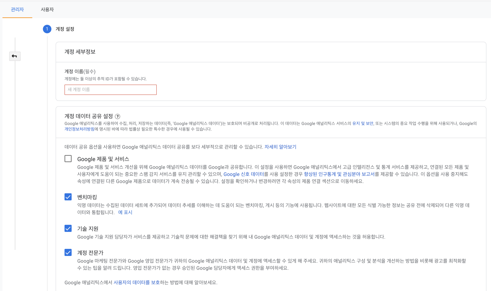
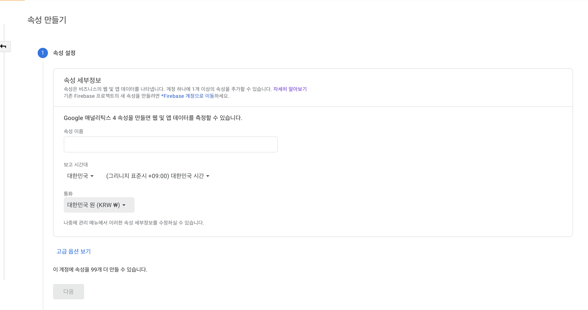
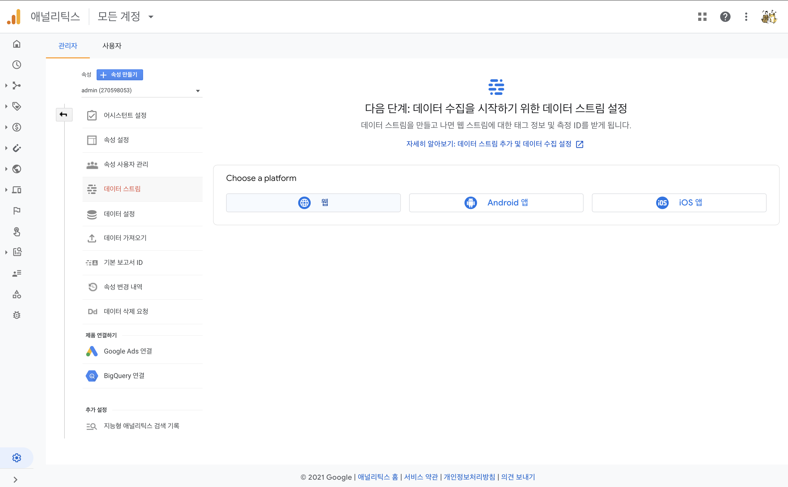
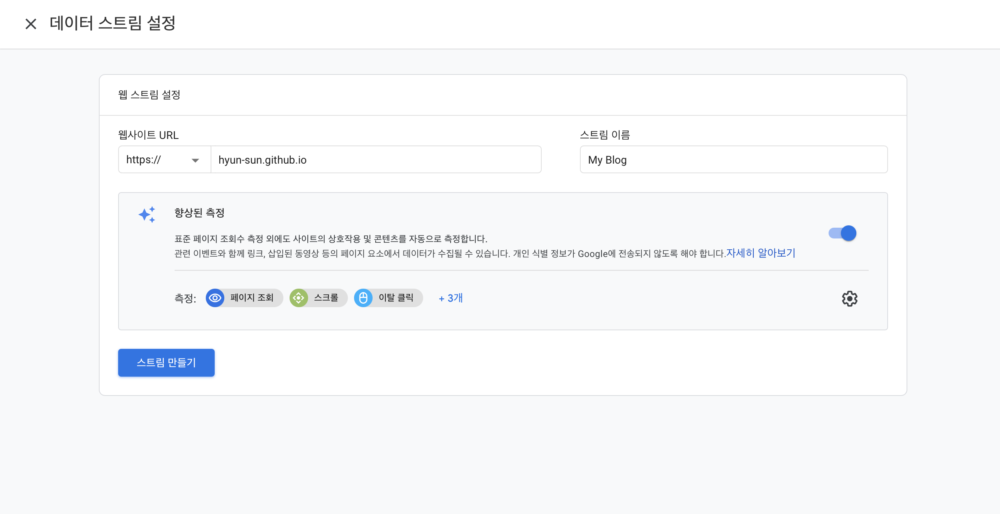
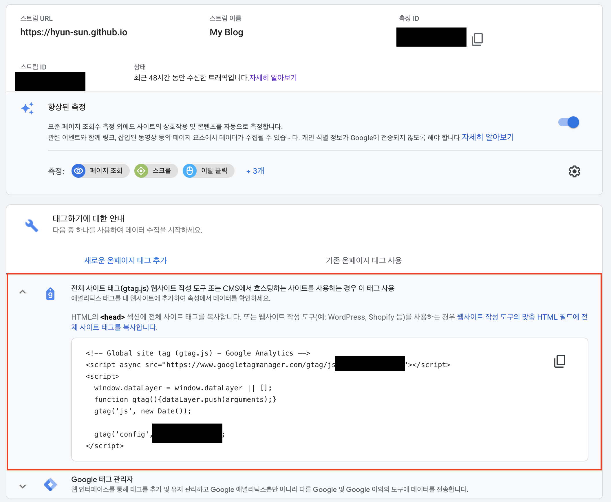
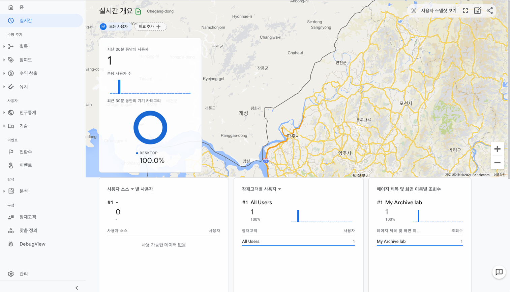

GitHub Blog에 Google Analytics를 연결하면 유입 분석, 사용자 분석 등을 할 수 있습니다.
아직 게시글이 하나밖에 없지만 블로그에 유입되는 사용자가 있는지 보고 싶어서 Google Analytics 를 연결하고 그 방법을 정리해봤습니다.

## 1. [Google Analytic](https://analytics.google.com/) 접속
당연히 구글 계정이 있어야합니다.
최초 접속 시 너무나 눌러야할거 같은 파란 버튼이 하나 있습니다. 그거 누르면 됨.

## 2. 계정, 속성 생성

둘 다 임의로 하고 싶은 이름 하면 됩니다. 걍 관리명이라 크게 의미 없는듯...

## 3. 데이터 스트림 생성
계정과 속성 생성이 끝나면 아직 아무것도 없는 대시보드가 나오고 왼쪽에 메뉴가 있음
`관리 > 데이터 스트림 > Choose a platform` 에서 웹을 눌러서 값들을 입력
 

## 4. 태그 복사

1. 데이터 스트림을 생성하면 위와 같은 화면이 나옴
2. 새로운 온페이지 태그 추가를 눌러서 나오는 html코드를 복사
3. 적용된 테마 설정마다 다른데 기본 원리는 사이트의 html 헤더에 포함이 되면 되는 것이기 때문에 사이트 설정에 맞춰 추가해주면 됨  
   (저는 `/_includes/head.html` 에서 불러오고 있는 `/_includes/google_analytics.html`을 사용)
   
## 5. 적용 확인
Git Push 후 Google Analytics 실시간 화면에서 제대로 적용 됐는지 확인

방문자 1.................
