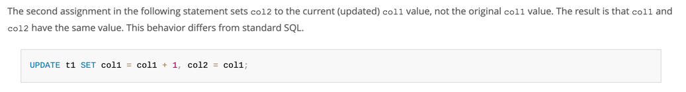

> [공식 문서](https://dev.mysql.com/doc/refman/8.4/en/update.html)

MySQL에서 UPDATE 문을 실행할 때, SET 절에 기술된 컬럼의 할당(assignment)은 왼쪽에서 오른쪽으로 순차적으로 평가됨. 이로 인해 SET 절 내에서 동일한 컬럼이 여러 번 참조될 경우, ANSI SQL 에서 기대하는 동작과 다른 결과를 초래할 수 있음

- 순차적 평가 (Sequential Evaluation): SET 절의 표현식은 순서대로 평가됨. 앞선 표현식에서 변경된 컬럼 값은 바로 다음 표현식에 영향을 미침
- 원본 값이 아닌 변경된 값 참조: SET 절의 뒷부분에서 컬럼을 참조할 때, 이는 UPDATE 문이 시작되기 전의 원본 값이 아니라, 해당 UPDATE 문 내에서 이미 변경이 완료된 값을 참조 

이는 대부분의 다른 데이터베이스 시스템이 UPDATE 문이 시작되는 시점의 원본 데이터 스냅샷을 기반으로 SET 절의 모든 할당을 동시에 평가하는 표준 SQL 동작 방식과 대조됨 

 
